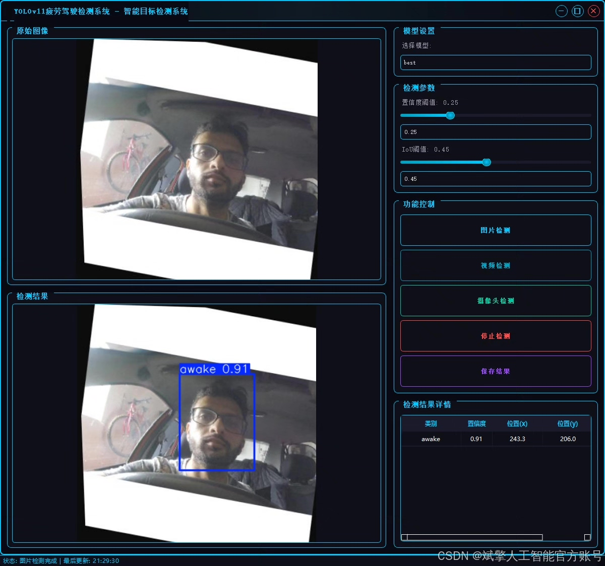
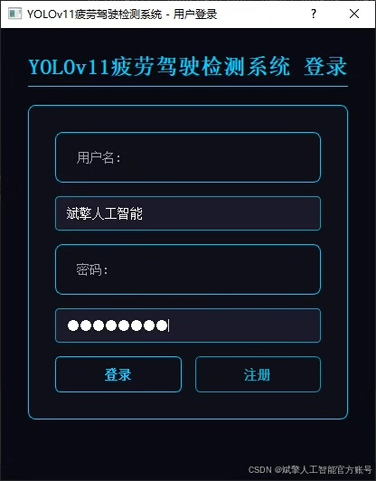
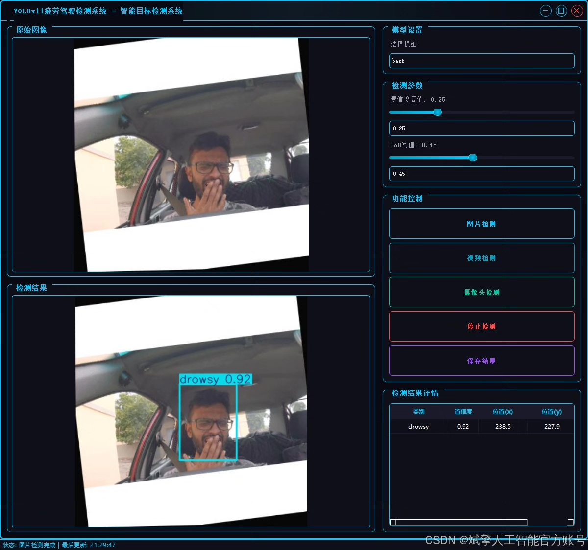
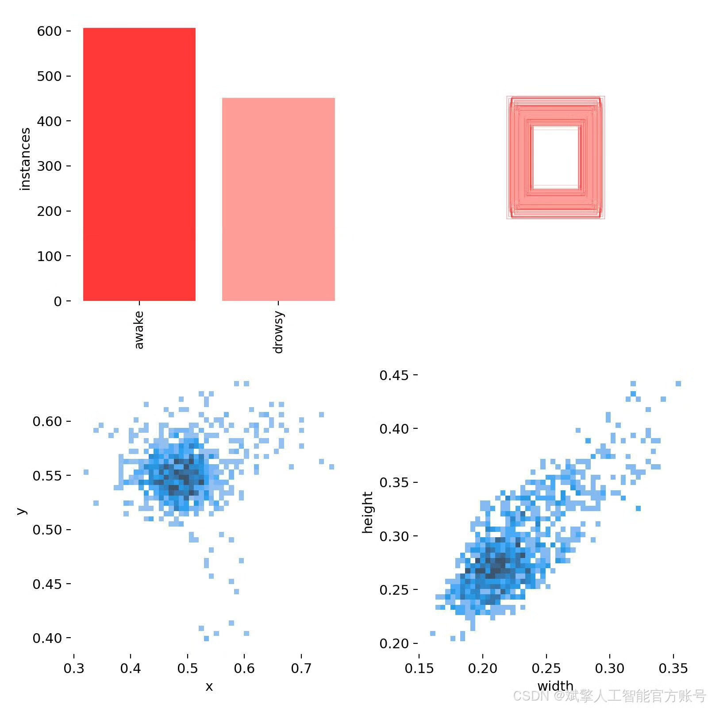
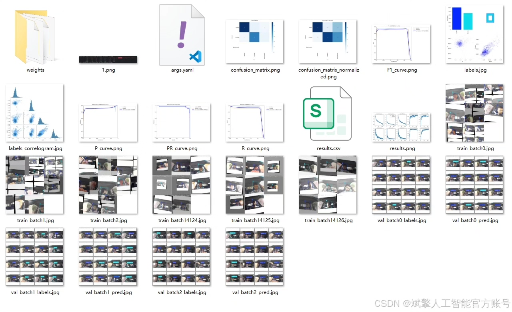
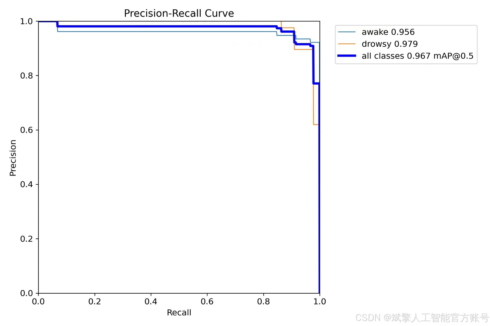
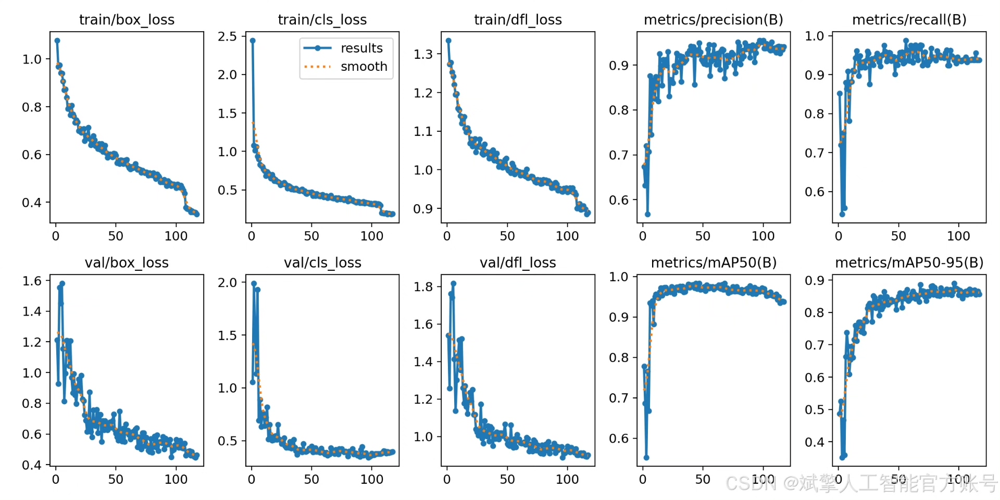
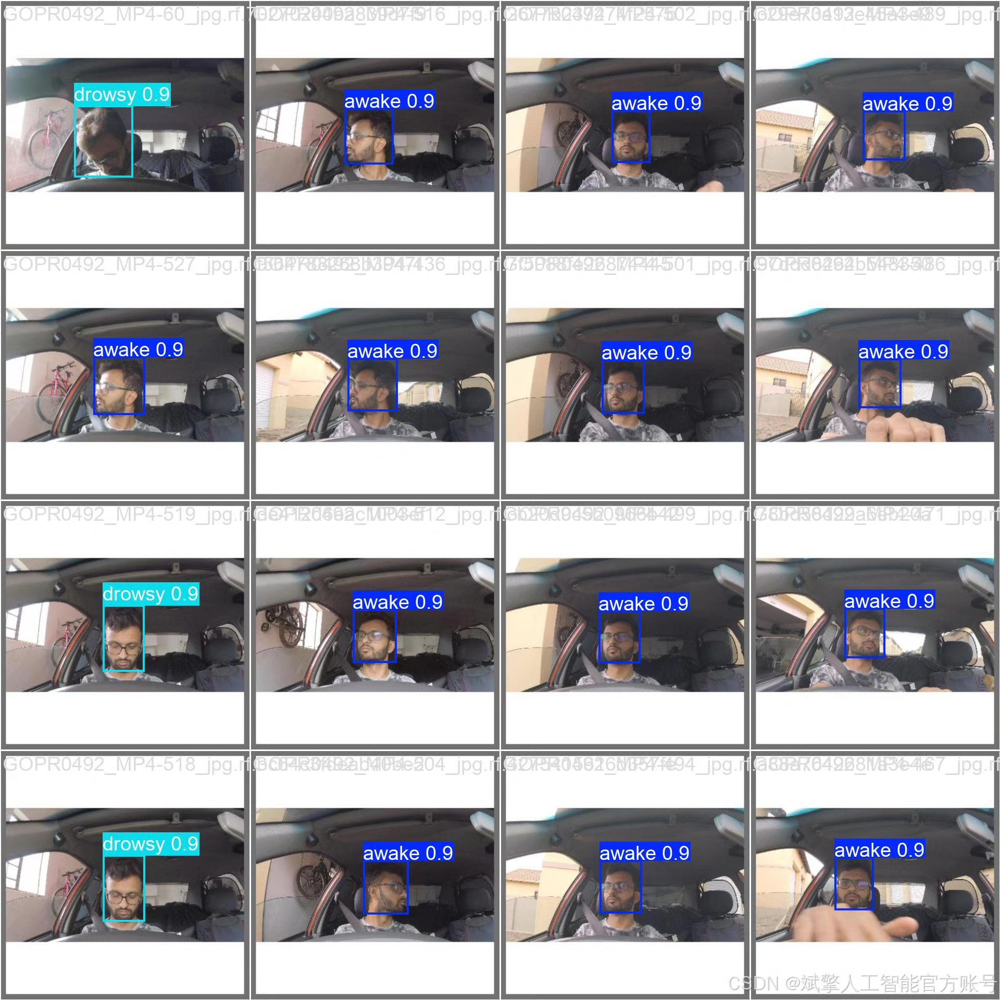

# YOLOv11 Fatigue Driving Detection System

## Body

YOLOv11 Fatigue Driving Detection System Based on Deep Learning YOLOv11, the system is developed for real-time monitoring of driver fatigue status. This system can capture the facial images of drivers through the vehicle camera in real time and accurately identify whether they are "awake" or "fatigued." After thorough training and validation on a custom dataset, the model exhibits excellent performance and can effectively detect key fatigue features such as closed eyes, nodding, drowsiness, etc.

Dataset:
nc: 2
names: ['awake', 'drowsy'],
dataset quantity: 1056 training set, 103 validation set, 71 test set

✅ User login registration: Supports password detection and security verification.
✅ Three detection modes: Based on the YOLOv11 model, supports image, video, and real-time camera detection, accurately identifying targets.
✅ Dual-screen comparison: Display original images and detection results on the same screen.
✅ Data visualization: Real-time table displaying the category, confidence, and coordinates of detected targets.
✅ Intelligent parameter adjustment: Offers a confidence slide bar to dynamically optimize detection accuracy, adapting to different scene requirements.
✅ Sci-fi style interface: Dark theme combined with dynamic light effects, reducing visual fatigue and improving operational experience.

## Images

## Payment

Here is a pay link on Stripe ( https://buy.stripe.com/3cs8yP7sY87d0vu9AB ). Please contact me lonlonago@foxmail.com after funding $89, and I will send you a complete data files , thank you!

